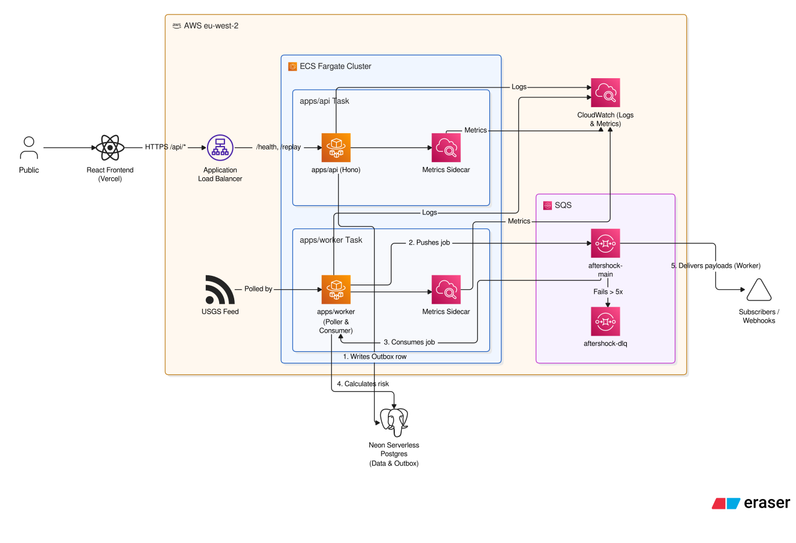

# Aftershock

Real-time seismic hazard exposure monitoring for critical infrastructure. Built for the AWS Builder Center "Zero to Shipped" hackathon.

Aftershock watches the live USGS earthquake feed, matches incoming events against a portfolio of real-world structures (bridges, dams, buildings), scores each one for exposure risk based on magnitude, distance, depth, and structure type, and delivers alerts as signed webhooks through a durable, event-driven pipeline.

The infrastructure is the point of the project, not a wrapper around an AI call. Everything in this pipeline, the transactional outbox, the idempotency guarantees, the dead-letter handling, the per-subscriber delivery tracking, is real and tested, not a simplification left for later.

## Architecture



Two independently deployed services, deliberately not one bundled task:

- **worker** (no public ingress): polls the USGS feed, relays a transactional outbox to SQS, and consumes jobs for risk scoring and webhook delivery.
- **api** (behind an Application Load Balancer, public): a Hono service serving read endpoints, the public status page, and a judge-facing event replay endpoint.

Splitting these was a reliability decision. A bug in the worker should never be able to take down the public-facing status page.

```
USGS feed → poll loop → [seismic_events + outbox, same transaction]
                              ↓
                      outbox relay → SQS (aftershock-main)
                              ↓
                      job consumer → geo-match → risk score
                              ↓
                  [risk_assessments, idempotent] → alert?
                              ↓
                  [alerts + outbox, same transaction] → SQS → webhook sender
                              ↓
                  per-subscriber delivery tracking (alert_deliveries)
```

## How it works

1. A background poller pulls new events from the USGS feed at a fixed interval. Each new event (deduplicated on USGS's own event ID) is written to the database and a transactional outbox entry in the same transaction.
2. An outbox relay picks up pending rows and pushes them to SQS.
3. A job consumer reads the queue, filters out events below magnitude 4.0, and geo-matches the remaining ones against the structure portfolio within a magnitude-scaled search radius.
4. Each in-range structure gets a risk score. Scores at or above the HIGH threshold create an alert, written alongside another outbox entry in the same transaction.
5. The alert is relayed to SQS and delivered as a signed webhook to every active subscriber, tracked individually so a failed delivery to one subscriber never blocks or duplicates delivery to another.
6. A public status page shows monitored structures, recent hazard events, generated alerts, and delivery outcomes, and includes a replay feature to trigger the full pipeline on demand using real historical USGS events.

## Risk scoring

```
risk_score = magnitude_factor(M) × distance_decay(D, M) × depth_factor(depth) × type_multiplier(type)

magnitude_factor(M)        = 2^(M - 5)
effective_radius_km(M)     = 50 × 2^(M - 5)
distance_decay(D, M)       = exp(-D / effective_radius_km(M))
depth_factor(depth_km)     = 1 / (1 + depth_km / 50)
type_multiplier            = { dam: 1.5, unreinforced_masonry: 1.6, bridge: 1.3, generic_structure: 1.0, reinforced_high_rise: 0.8 }
```

Scores bucket into `LOW`, `MODERATE`, `HIGH`, and `CRITICAL`. This is an engineering-judgment model shaped by standard seismic attenuation principles, not a calibrated Ground Motion Prediction Equation. It produces a relative exposure score, not a measured or estimated Peak Ground Acceleration, and hasn't been validated against observed structural damage. Treat its output as a relative indicator, not an authoritative safety assessment.

## Durability mechanisms

- **Transactional outbox**: every domain write that needs to notify something downstream writes its row and an outbox row in one transaction, so a crash between the two is structurally impossible.
- **Idempotent ingest**: USGS's own event ID is the primary key, with insert-or-skip on conflict, so re-polling the feed never duplicates downstream work.
- **Two independent idempotency layers for scoring**: a job execution log (keyed by event + structure) and a separate unique constraint on the risk assessment table itself, so duplicate execution under a race is possible, but duplicate data is not.
- **Per-subscriber webhook delivery tracking**: a redelivered alert job only retries the subscribers that previously failed, not everyone.
- **Dead-letter queue**: messages that fail repeatedly (5 receives) are isolated instead of retried forever.

## Demo / event replay

Waiting for a real magnitude 4+ earthquake to land near a seeded structure during a short review window isn't realistic. The status page includes a replay feature that pushes real, previously recorded USGS events (not fabricated payloads) through the live pipeline on demand. Each replay gets a fresh identifier so concurrent replays don't collide with the deduplication logic that protects the real feed, and every replayed record is tagged `isReplay: true` and marked `REPLAYED` in the UI, so replayed and live data stay honestly distinguishable.

## Telemetry & observability

Both services emit structured logs and Prometheus metrics through a shared `@repo/telemetry` package.

**Structured logging (pino).** Every log line is newline-delimited JSON, so CloudWatch Logs Insights can query fields directly (`fields @timestamp, msg, hazardEventId | filter level = "error"`). In development the `dev` scripts pipe stdout through [`pino-colada`](https://github.com/lrlna/pino-colada) for human-readable output, so the logger itself always emits JSON and nothing extra ships to production. The API attaches a per-request child logger with a `requestId` (honouring an inbound `x-request-id`) and logs one access line per request with method, path, status, and latency — health-check and metrics-scrape paths are skipped in production to keep the log stream signal-dense, but logged in development. Secrets and webhook signatures are redacted before they reach the log stream.

**Prometheus metrics.** The API exposes `GET /metrics`; the worker runs a small HTTP server on `METRICS_PORT` (default `9464`) exposing `/metrics` and `/health`. Both registries include Node process metrics (CPU, memory, event-loop lag, GC) plus domain metrics:

| Metric | Type | Meaning |
|---|---|---|
| `aftershock_http_requests_total` | counter | API requests by method/route/status |
| `aftershock_http_request_duration_seconds` | summary | API request latency (p50/p90/p99) |
| `aftershock_ingest_events_total` | counter | USGS events by outcome (inserted/duplicate/error) |
| `aftershock_ingest_cycle_duration_seconds` | summary | Full ingest cycle duration (p50/p90/p99) |
| `aftershock_outbox_relayed_total` | counter | Outbox rows relayed to SQS by outcome |
| `aftershock_outbox_pending_batch` | gauge | Pending outbox rows in the last relay batch |
| `aftershock_jobs_processed_total` | counter | Queue jobs by event type and outcome |
| `aftershock_job_duration_seconds` | summary | Queue job processing latency (p50/p90/p99) |
| `aftershock_risk_assessments_total` | counter | Risk assessments by bucket |
| `aftershock_alerts_triggered_total` | counter | Alerts triggered by bucket |
| `aftershock_webhook_deliveries_total` | counter | Webhook deliveries by outcome |
| `aftershock_webhook_delivery_duration_seconds` | summary | Webhook delivery latency (p50/p90/p99) |

Every series carries a `service` label (`aftershock-api` / `aftershock-worker`) so a single scrape config can distinguish them. Latency metrics are **summaries, not histograms** — the CloudWatch agent drops Prometheus histogram metrics, so summaries are what actually reach CloudWatch. Set `LOG_LEVEL` to control verbosity (defaults to `debug` in dev, `info` in production).

### CloudWatch ingestion

The CloudWatch agent runs as a **sidecar container** in each task definition, scraping `localhost` (the worker on `:9464`, the API on `:3000`) and remote-writing to the `Prometheus` namespace. This avoids ECS Service Discovery entirely — the agent shares the task's network namespace, so no cross-task networking is needed.

Provision the AWS side (SSM parameters, IAM policies, and alarms) with:

```bash
pnpm telemetry:setup
```

This is idempotent and creates:

- **SSM parameters** `/aftershock/cw-agent-config-{api,worker}` — the agent scrape configs (`infra/cloudwatch/`).
- **IAM inline policies** on both task roles — `cloudwatch:PutMetricData` (scoped to the `Prometheus` namespace) and `ssm:GetParameters` (`infra/iam/`).
- **CloudWatch alarms** on the three critical failure states:
  - `aftershock-outbox-stagnation` — `aftershock_outbox_pending_batch > 50` for 3 datapoints in 3 minutes (relay stalled or SQS blocking).
  - `aftershock-webhook-delivery-failures` — `aftershock_webhook_deliveries_total{result="failed"} > 10` in 5 minutes (egress or client endpoint failures).
  - `aftershock-ingest-latency-p90` — `aftershock_ingest_cycle_duration_seconds{quantile="0.9"} > 30s` (USGS polling hanging).

Set `SNS_ALARM_TOPIC_ARN` to wire the alarms to an SNS topic for notifications.

## Tech stack

- TypeScript, pnpm workspace monorepo
- [Hono](https://hono.dev/) for the API
- [Drizzle ORM](https://orm.drizzle.team/) + [Neon](https://neon.tech/) serverless Postgres
- [pino](https://getpino.io/) structured logging + [prom-client](https://github.com/siimon/prom-client) metrics
- AWS SQS (standard queue + DLQ), AWS Fargate (two services), Application Load Balancer
- Podman for containerization
- [Kiro](https://kiro.dev/) for AWS-side IAM policy and task definition generation during deployment

## Project structure

```
apps/
  api/      # Hono service: REST endpoints, status page, replay endpoint
  worker/   # USGS poller, outbox relay, SQS job consumer
packages/
  db/         # Drizzle schema, client, shared ingest logic
  shared/     # Event types, geo math, risk thresholds
  telemetry/  # pino logger factory + prom-client registry/middleware
```

## Running locally

```bash
pnpm install

# packages/db needs a real Postgres connection string (Neon or local)
cp .env.example .env

# push the schema and seed the structure portfolio
pnpm db:migrate
pnpm --filter @repo/db exec tsx src/seed.ts

# run both services
pnpm --filter @repo/worker dev
pnpm --filter @repo/api dev
```

`apps/api` serves the status page at `/status.html` once running, by default on `http://localhost:8000`.

## Testing

```bash
pnpm test
```

Unit tests cover the risk-scoring formula against real historical fixtures (a verified M7.1 near Miyazaki, Japan, and a sub-threshold M2.4 at The Geysers, California), including a hand-calculated worked example.

## Deployment

Both services deploy to AWS Fargate behind their own task definitions. A local deployment script handles the full cycle (build, push to ECR, register the task definition, force a new ECS deployment):

```bash
pnpm deploy:aws
```

See `scripts/deploy.sh` for the exact steps. Task definitions are not committed to the repo (they contain account-specific ARNs); see `api-task-def.example.json` and `worker-task-def.example.json` for sanitized templates.

## Known limitations

- The structure portfolio is a small, fixed seed set (eight real, named structures), not a real asset registry. A production version would make this a customer-managed resource.
- The risk formula is intentionally simple and legible, not a calibrated engineering standard. See [Risk scoring](#risk-scoring) above.
- The USGS feed is polled, not pushed, so there's some detection latency between a real event and the system picking it up.
- Metrics are exposed for scraping, but no CloudWatch dashboard or alarms are provisioned in this repo — the scrape/ingest wiring is left to the deployment environment.

## License

[MIT](./LICENSE)